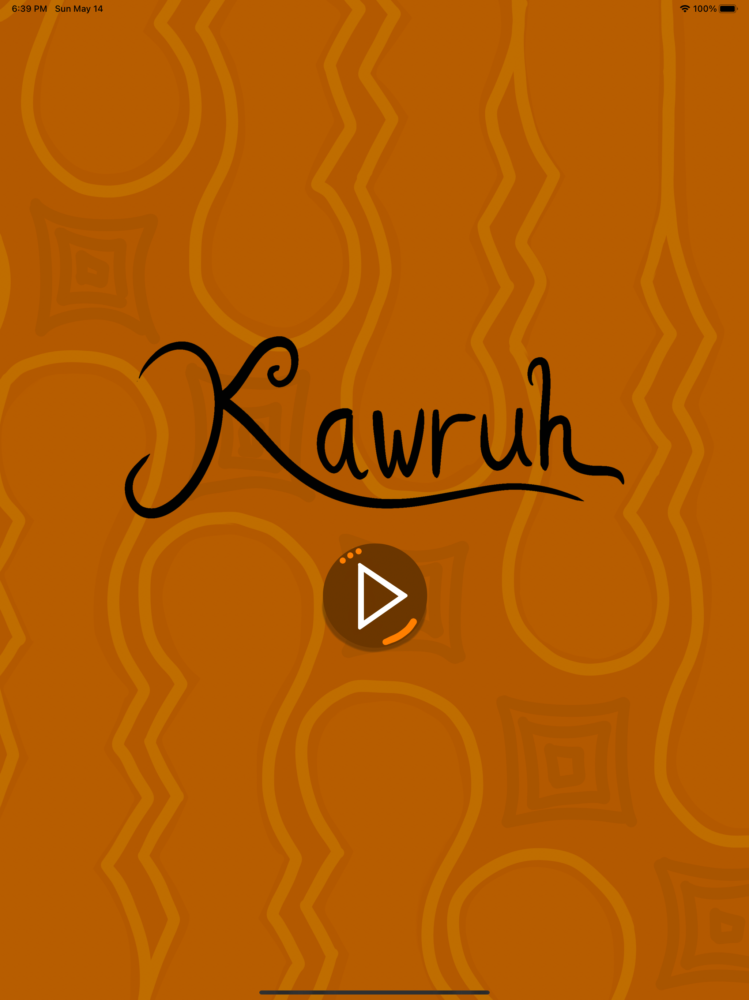
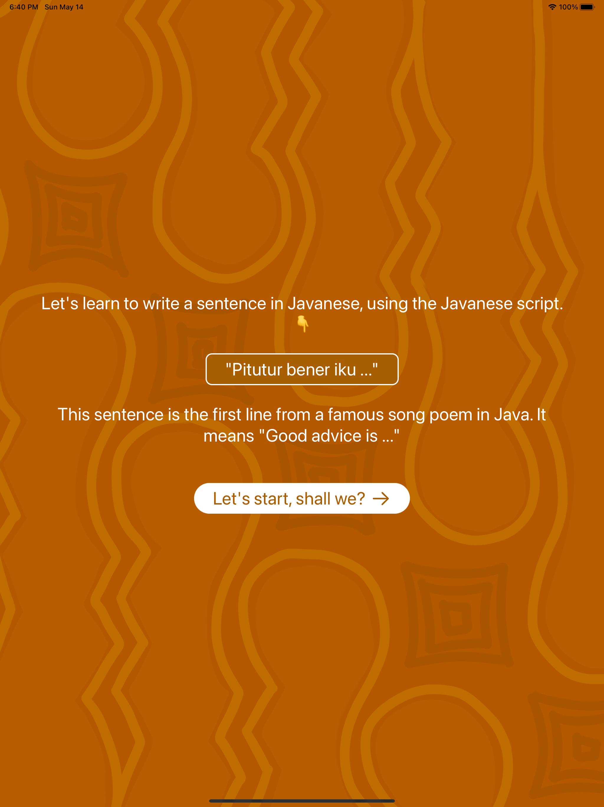
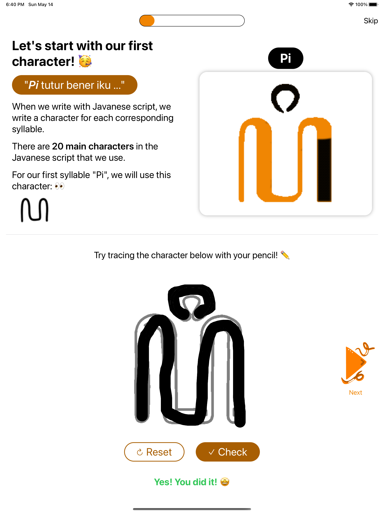
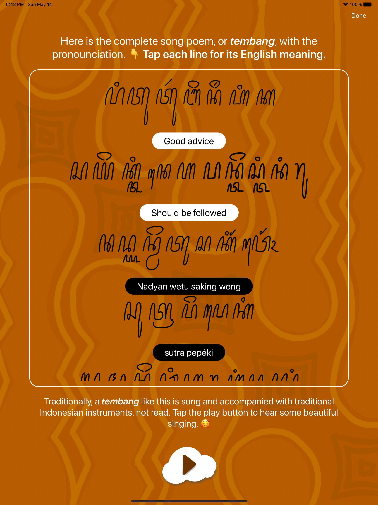
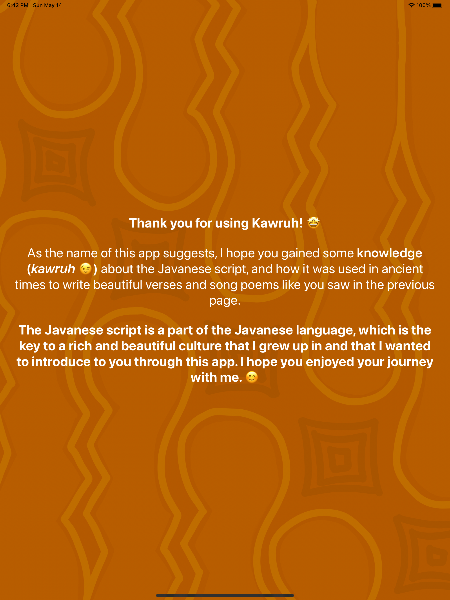

# [ACCEPTED] Kawruh - WWDC23 Submission

</img>

Kawruh is an iPad app built with SwiftUI and AVFoundation that allows users to learn Javanese script while experiencing Javanese music and art. Users can follow on-screen instructions to trace a sentence using Javanese script while listening to traditional Javanese gamelan music and discover a traditional Javanese song poem written using Javanese script which embodies the moral values of the Javanese. The added music and Javanese art background aims to enrich the users’ experience.

  </img>
  </img>
  </img>
  </img>

